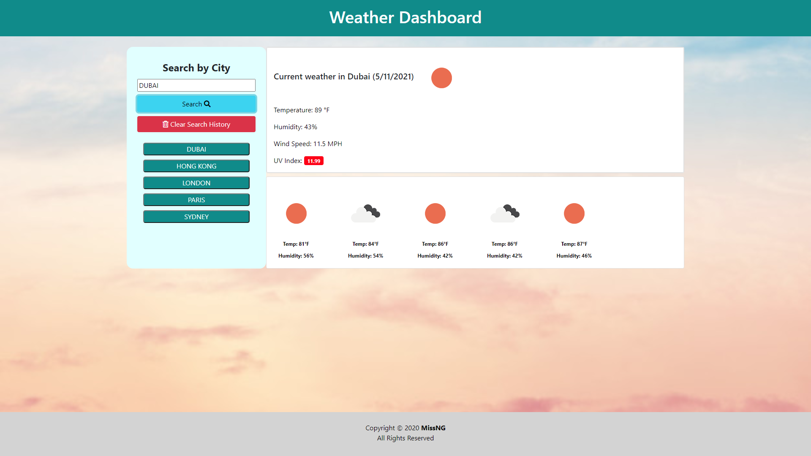

# 06 Server-Side APIs: Weather Dashboard

⋘ ──── ∗⋅◦∘◈\[[MissNG Weather Dash](https://missng-git.github.io/WeatherDash/)\]◈∘◦⋅∗ ──── ⋙

Using the [OpenWeather API](https://openweathermap.org/api) to retrieve weather data for cities, I have built a weather dashboard that will run in the browser and feature dynamically updated HTML and CSS, as well as utilising persistent data stored in a user's `localStorage`.

## ≫ ──── ≪•◦ Objectives ◦•≫ ──── ≪

```
+ Help travelers plan trips by retrieving weather data
+ Allows users to research weather outlook for multiple cities
+ Provide user-friendly tool for global weather forecasts
```

## ≫ ──── ≪•◦ Mock-Up ◦•≫ ──── ≪

The following image demonstrates the application functionality:



### ≫ ──── ≪•◦ Overview of Code Functionality ◦•≫ ──── ≪

1. Application displays weather dashboard with form inputs.

2. Application includes working search function allowing users to input city to retrieve current and future weather conditions and add city to search history.

3. Application displays all pertinent information including city name, the date, an icon representation of weather conditions, the temperature, the humidity, the wind speed, and the UV index.

4. Application allows user to view UV index and shows color indicator to advise whether conditions are favorable, moderate, or severe.

5. Application's dashboard presents user with future weather conditions for the specified city, displaying a 5-day forecast that includes the date, an icon representation of weather conditions, the temperature, and the humidity.

6. Application allows users to click on a previously searched city and re-visit the weather conditions for that city.

7. Application displays last searched city forecast when user opens the weather dashboard.

### ≫ ──── ≪•◦ Usability ◦•≫ ──── ≪

- Click into text box of the "Search City or Postcode" section on the left of dashboard

- Click on the magnifying glass (🔎) or press 'Enter' to search for the desired city
  **Note:** _Each city you search for will be listed in your search history under the search section_

- View the current weather in the top section of the weather display and the 5-day forecast in the lower section;
  ==> Relevant information displayed will include:

  > 1.  City Name
  > 2.  Date
  > 3.  Icon representation of weather conditions
  > 4.  Temperature
  > 5.  Humidity
  > 6.  Wind Speed
  > 7.  UV Index, color-coded:
  >     \+\+ **GREEN** for _Favorable_ conditions
  >     \+\+ **YELLOW** for _Moderate_ conditions
  >     \+\+ **RED** for _Severe_ conditions

- Click on a city in your search history to review that city's information again 🌞
